## 应用操作技巧
 应用操作技巧主要展示各个小模块的使用技巧。

###可导入符号表
符号表导入适用于所有支持调用栈的Tab页，选择一个文件夹，获取文件下及其子文件夹的所有so文件，更新数据库中符号数据。文件夹内so的格式需要与在设备上的路径一致，例如下图中，选择的文件夹为import，选择导入的libnative_hook.z.so，在设备上的路径是/system/lib64/，那么在本地选择的文件夹内也需要保证路径是import/system/lib64/libnative_hook.z.so。

以NativeMemory举例，导入NativeMemory文件，点击Call info的Tab页，在搜索框中输入libnative_hook.z.so，会发现该so下的调用栈没有符号化完全。

将本地编译的so通过导入按钮导入，本地导入路径是import/system/lib64/libnative_hook.z.so，红框处是导入按钮

导入so以后，在搜索框中输入libnative_hook.z.so，会发现符号化数据已经更新

###网页连接文件打开接口
网页连接文件打开接口可以在网址后增加文件地址，打开后直接打开trace。
接口的url路径如下：

+     蓝色框：是Smartperf工具的url(https://localhost:9000/application/)。
+     绿色框：trace文件的url，其中
                    第一部分是?trace=(固定格式)。
                    第二部分是trace文件的url(https://iot.itocm.com:9001/upload/ftrace_small.txt),此处根据文件的url实际地址填写。
                    第三部分,&link=true(固定格式)。

###Tab页信息和泳道图可跳转(点击和框选场景,框选类似搜索)
泳道图高亮场景：框选Cpu Frequency 或者Cpu State泳道图后，弹出Cpu Frequency或Cpu State Tab页，在点击Tab页表格的行时，框选范围泳道图的当前行的Value值一样的部分上方会出现一条以圆点开头颜色比趋势图颜色同色但稍深的粗线条，如下图:
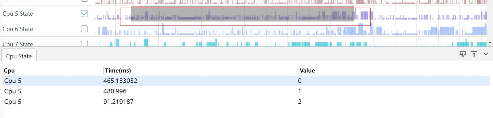
搜索场景：框选函数调用栈的泳道图，弹出Slices Tab页，点击表格行，会跳转到框选范围内的第一条调用栈的位置，点击下图Slices Tab页的H:FlushVsync调用栈。
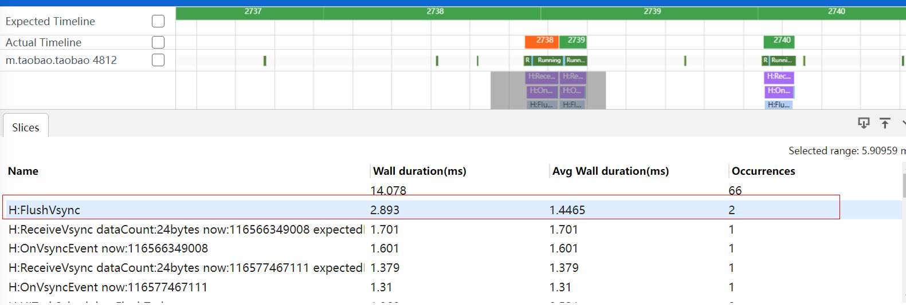
会跳转到H:FlushVsync调用栈的位置。
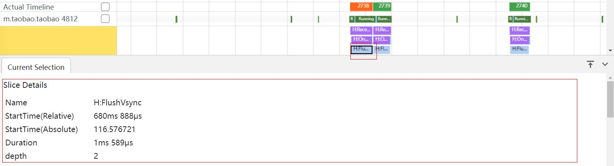
###Tab页中start time支持绝对时间
在有startTime的点选Tab页（目前有PurgeTotal、PurgePin、Current Selection三个）中添加绝对时间，startTime是以抓取时间为参考，开始抓取时间为0，取当前点选数据的startTs属性即可，绝对时间是数据上报的时间显示，如下图:
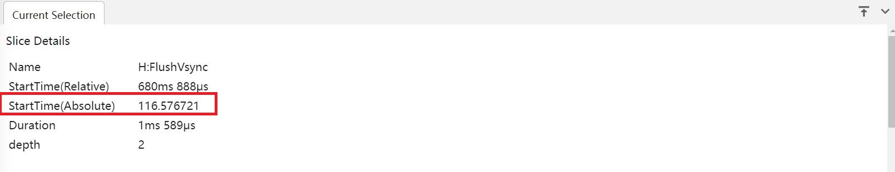
###支持基于优先级的线程状态展示
Sched Priority Tab页，按优先级显示调度，显示框选范围内所有Running以及Running之前的Runnable线程的最小，最大，平均耗时。 
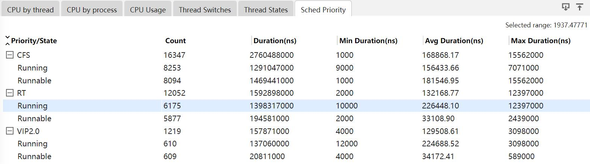
###内容支持宽度可伸缩
原来表格的单元格宽度是设置好的，有些单元格里的内容比较长，看不到全部，现在每行的表头添加一个灰色竖线，拖动时单元格宽度随之改变。
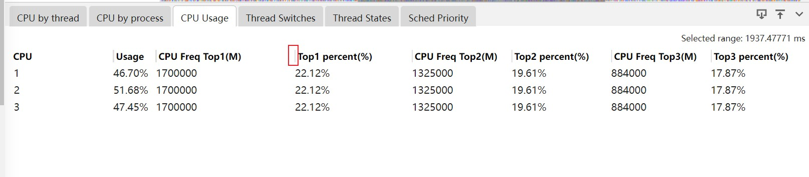
###一键展开和收起，逐级展开和收起
将树形表格全部改为默认收起，在表头左上角添加双尖箭头图标,默认箭头朝外，点击图标，表格的每一层都展开，图标上的箭头改为朝里面，再次点击表格每一层都收起，图标上的箭头改为朝外面
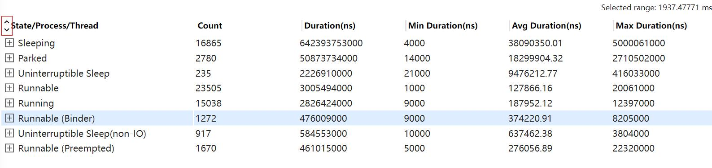
###支持shift+m多次框选，框选列表显示和操作（跳转，取消）,快捷键跳转ctrl+[/]和一键取消
每次框选泳道图后，按下shift+m键，在当前框选的开始和结束位置出现卡尺，如果只按下m键，会将上一次按m键出现的卡尺清除，在当前框选位置画卡尺，页面上每个卡尺都放进tab页中，在tab页中可以给卡尺改变颜色和移除旗子。用快捷键改变当前选中的卡尺。按下快捷键“ctrl+[”或“ctrl+]”的时候，会跳转到当前选中卡尺的上\下一个卡尺上，也就是上\下一个卡尺两侧变为实心，对应表格中的那行背景颜色变浅蓝色。

###旗子标记可快速跳转，框选列表显示和操作（跳转，取消）,快捷跳转ctrl+;/’和一键取消
在时间刻度下方点击会出现旗子和tab页，每次点击都将旗子都放进tab页中，在tab页中可以给旗子改变颜色和移除旗子。用快捷键改变当前选中的旗子。按下快捷键“ctrl+，”或“ctrl+.”的时候，会跳转到当前选中旗子的上\下一个旗子上，也就是上\下一个旗子变为实心有旗杆，对应表格中的那行背景颜色变浅蓝色。
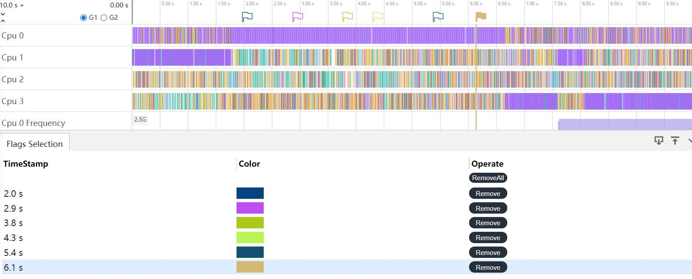
###泳道图支持一键收起和展开（收起前的状态）
点击时间刻度的最左边的双箭头，可以对已展开的泳道图进行一键收起和展开
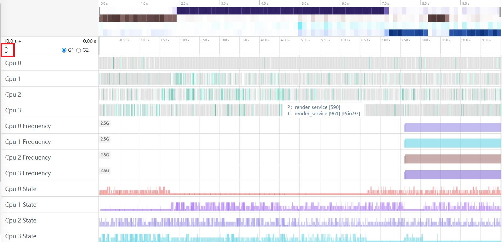
###单个泳道图显示为多行时可折叠为1行（收藏和非收藏）
单个泳道图点击会将泳道图折叠为一行，折腾后的字体是蓝色。
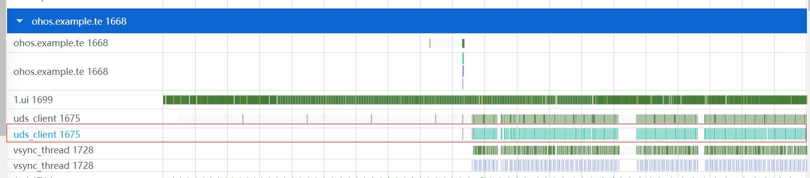
###已支持的泳道图按照模板分类显示，NaitveMemory，Hisysevent，应用内存等
导入trace文件后，页面右上角的出现漏斗图标，点击会出现Display Template页面，Template Select区域显示已经添加到显示模板中的泳道图，每类泳道图后面会有一个多选框，默认不勾选，如果勾选页面上就只保留勾选的泳道图。
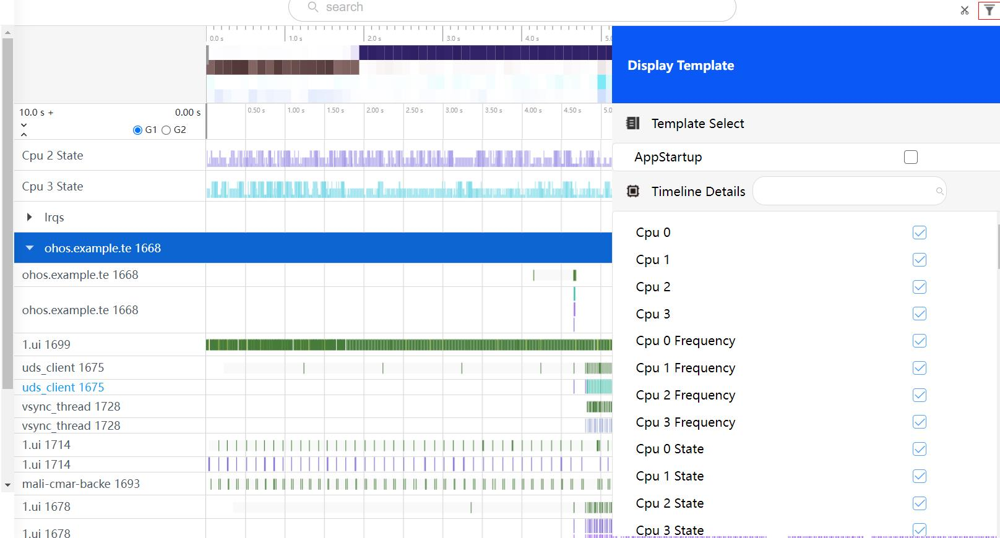
###所有进程的用户输入事件归一显示，观察操作事件和对象
对于用户InputEvent会绘制到固定的泳道图。
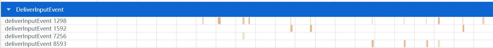
###支持收藏的泳道图整体画布可伸缩
收藏以后的泳道图可以在红线位置处上下伸缩拖动。
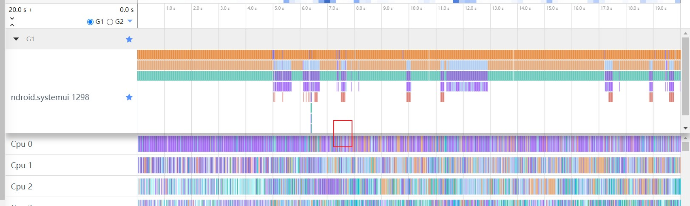
###用户自定义分组化收藏（2组），及一键取消所有收藏
选择界面上的G1和G2，可以根据自己的需求将泳道图收藏到对应G1或者G2中，点击G1和G2旁边的星号可以一键取消所有收藏。
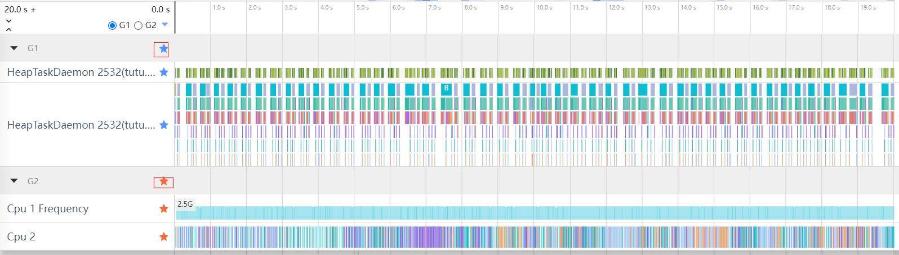
###trace顶部的cpu负载预览颜色随着负载降低，亮度降低的能力对比度提升
原来表示负载的颜色利用了透明度，对比不够明显，此次修改利用颜色的亮度，负载越大颜色更深，最深的接近黑色，负载越小颜色越浅，最浅的的为白色。

###导航栏/泳道图背景颜色支持颜色可选，字体颜色可感知slice的颜色而进行变化，颜色动态可配
给用户提供两种模式，浅色模式（导航栏白底黑字，泳道图颜色偏淡）和深色模式（导航栏黑底白字，泳道图颜色偏深），点击最左下方的小桶标志用户可以按需选择，并且用户可以自定义systemTrace页面的颜色，给用户更多自由，自己动手设置自己喜欢的颜色，提升用户体验。
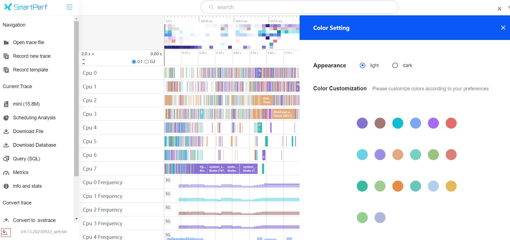
###高阶debug sql指导：Sample queries，比如CPU，线程，内存，io的等
用户根据需要了解的trace数据，可以点击预置好的sql查询出对应的数据。
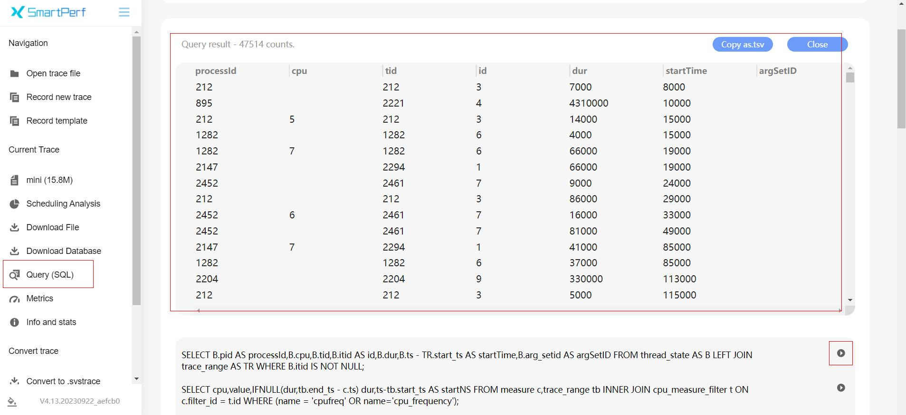
###鼠标滚轮放大、缩小（已支持），ctrl+滚轮左右拖动跟手性优化
用户可以利用鼠标滚轮对界面进行放大和缩小，ctrl+滚轮左右拖动。
###历史搜索关键字可显示/可选择查找
在搜索框里的关键字可以保留显示，用户可以直接选择对应的关键字进行搜索，点击删除也可以将关键字删除。

###线程唤醒关系树
线程唤醒关系树功能是指在系统打开trace文件解析完成之后，在CPU泳道图上点选，可以查看该线程Slice的唤醒关系树，点击GetWakeupList会以链式结构和表格分别在泳道图和tab上展示线程的唤醒关系树信息,点击GetWakeupList按钮旁边的星号按钮可以对唤醒树对应的泳道图一键收藏。
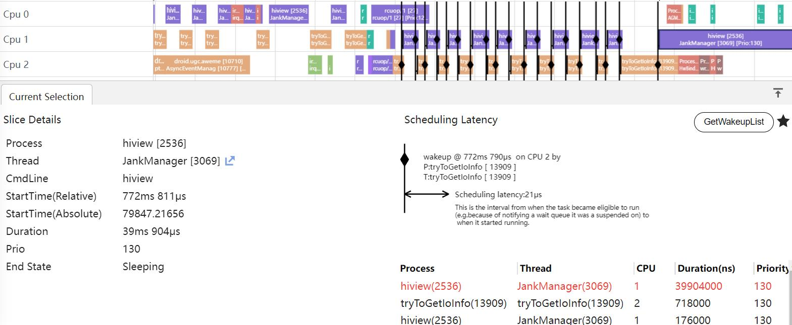
###Trace抓取动态可停
在抓取trace过程中，点击StopRecord按钮会对抓取命令进行启停,等待抓取停止命令返回后,将生成的文件拉取下来进行文件的解析。
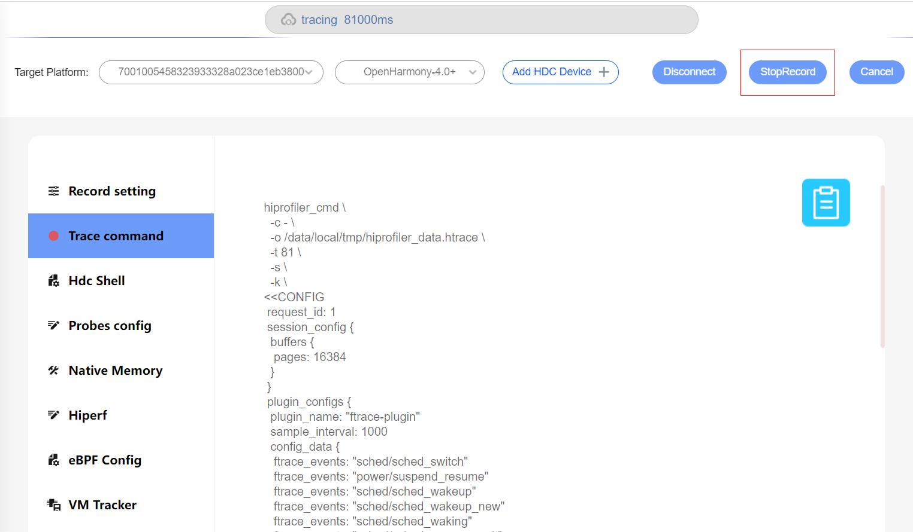
###Smartperf web端集成hdc命令能力
在现有的配置界面上，新增一个Web版本的shell界面，可以支持shell命令
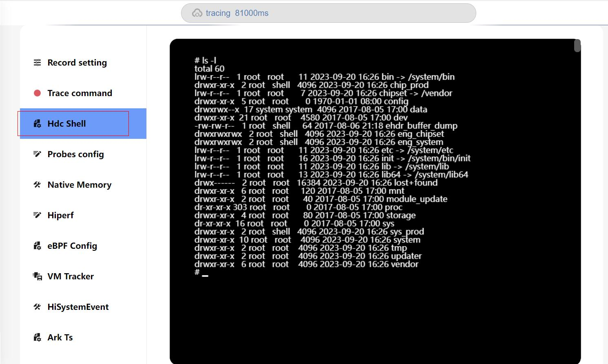