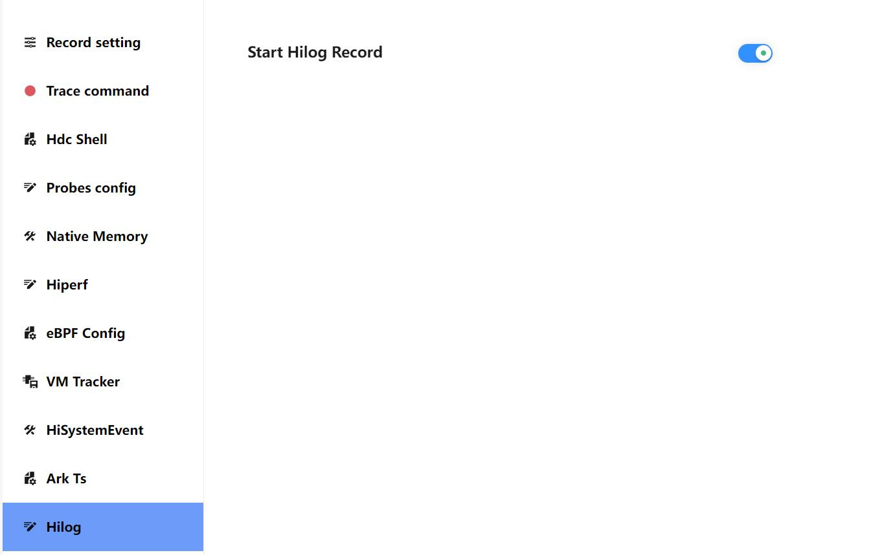
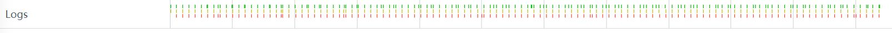
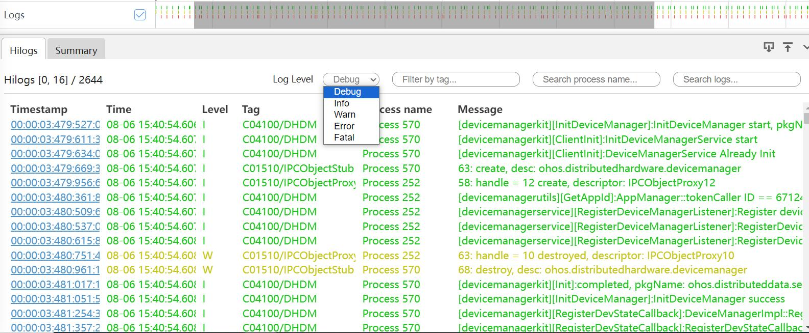
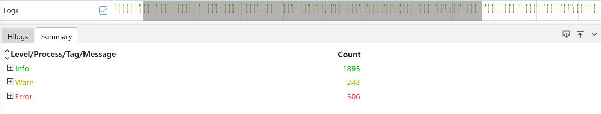

# Hilog抓取和展示说明
Hilog分析模块主要展示系统日志信息。
## Hilog的抓取
#### Hilog的抓取配置参数
打开Hilog开关抓取taskpool数据。

### Hilog展示说明
将抓取的hilog文件导入到smartperf中，查看日志信息。

### Hilog泳道图的框选功能
框选Hilog的泳道图，展示Hilog的tab页,Log Level可以选择日志级别，也能根据Tag，Process name，Message去搜索。

+     Timestamp： 时间戳信息。
+     Time： 日志的显示时间。
+     Level：日志级别。
+     Tag：日志的tag。
+     Process name：进程名。
+     Message：日志具体信息。
框选Hilog的泳道图，展示Summary的tab页。

+     Level/Process/Tag/Message： 根据类别显示日志。
+     Count： 各级别日志的条数。