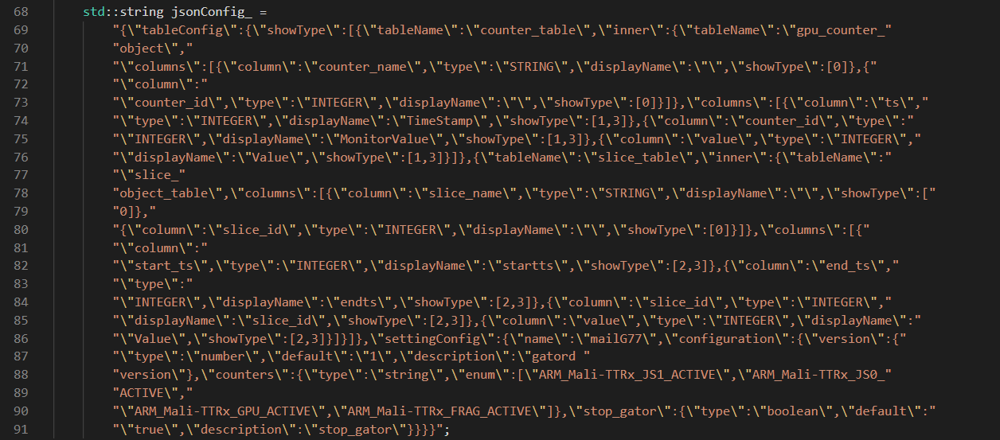
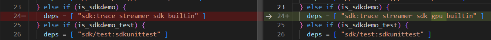
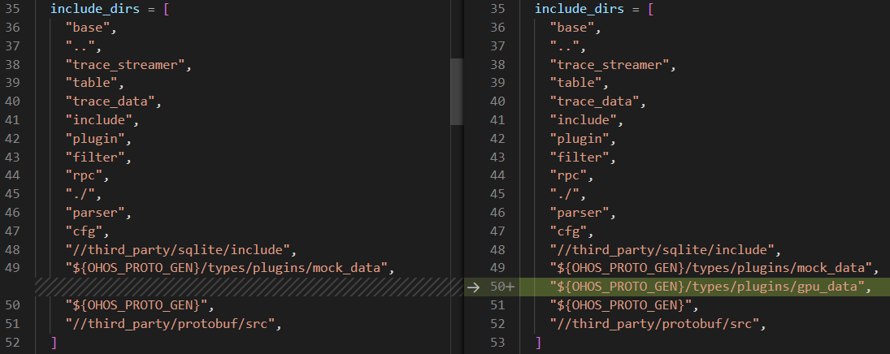
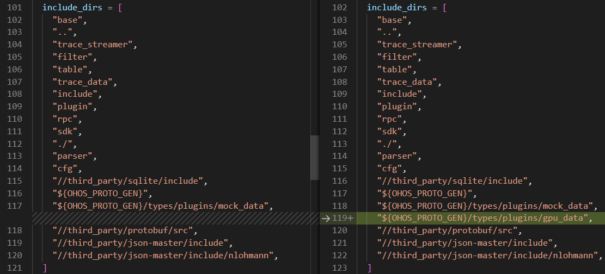
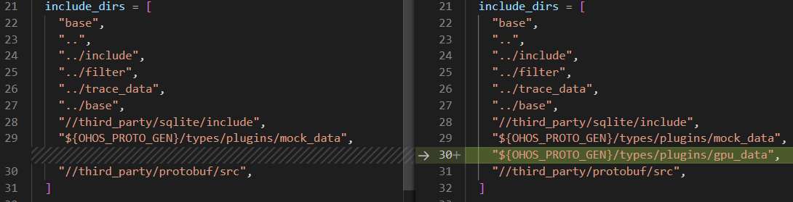
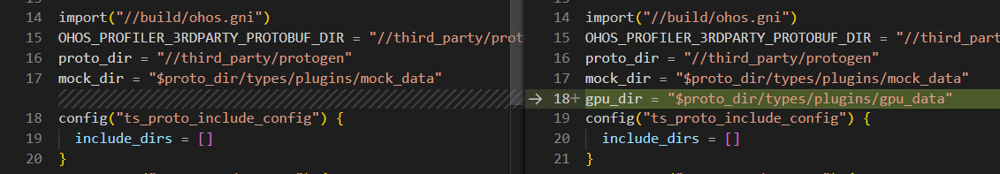
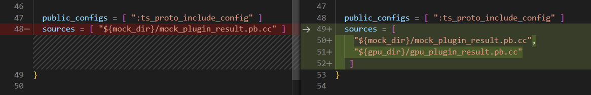
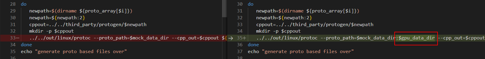

# 1、SDK接口说明

### 1.1 SDK对开发者开放的接口（位于文件sdk/sdk/ts_sdk_api.h,示例代码位于plugin目录下）

###### **设置对应的表名称** ，用户可选择调用。如不调用该接口，则默认的表名分别为counter_table, gpu_counter_object, slice_table, slice_object_table

`counterObjectTableName: countObject表名`

`counterTableName: counterTableName表名`

`sliceObjectTableName: sliceObjectTableName表名`

`sliceTableName: sliceTableName表名`

```
int SDK_SetTableName(std::string counterObjectTableName, std::string
counterTableName, std::string sliceObjectTableName, std::string
sliceTableName);
```

###### 添加counter业务ID和名称对应关系表。

`counterId: counter唯一标识。`

`columnName: counter名称。`

`return: 成功返回0，失败返回-1。`

```
int SDK_AppendCounterObject(int counterId, const char* columnName)
```

###### ******添加counter****业务表字段**

`counterId: counter唯一标识`

`ts: 时间戳`

`value: counter值`

`return: 成功返回0，失败返回-1`

```
int SDK_AppendCounter (int counterId, uint64_t ts, int value)
```

###### **添加slice业务ID和名称对应关系表**

`sliceId: slice唯一标识`

`columnName: slice名称`

`return: 成功返回0，失败返回-1`

```
int SDK_AppendSliceObject(int sliceId, const char* columnName)
```

###### ******添加slice****业务表字段**

`sliceId: slice唯一标识`

`ts: 起始时间戳`

`endTs: 结束时间戳`

`value: slice值`

`return: 成功返回0，失败返回-1`

```
int SDK_AppendSlice(int sliceId, uint64_t ts, uint64_t endTs, int value)
```

### 1.2 TraceStreamer SDK需用户实现的功能(plugin目录下）

###### 使用TraceStreamerSDK，用户需要实现2个功能：

`1. sdk_plugin_init_table_name：设置用来保存slice数据和counter数据的4张数据表；`

`2. sdk_plugin_data_parser：实现数据解析，并在解析到对应的数据时，使用1.1中的api即可，之后，上层IDE使用目录2中的方法，即可实现TraceStreamer和第三方插件（基于SDK开发）的数据互通。`

### 1.3 TraceStreamer SDK修改配置项

如需修改界面展示名称或其他配置项，可在目录sdk/sdk/sdk_data_parser.h中修改86行后settingConfig之后的配置。



### 1.4 不同名称的sdk编译方法

###### 1.4.1 新增proto文件后，如果文件格式和mockdata一致，则只需要修改wasm编译名称。  以下是需要修改的脚本文件：

1. `最外层BUILD.gn文件中24行修改为需要生成的wasm名称。`

   
2. `sdk/BUILD.gn文件20行名称修改为需要生成的wasm名称。`

   
3. `sdk/BUILD.gn文件163行后wasm_lib和name对应的参数修改为需要生成的wasm名称。`

   

###### 1.4.2 新增proto文件后，如果proto文件格式和原有的mockdata格式不一致，则需要用户自己通过proto文件导出对应的pb.cc文件，并完成数据解析代码。以下是导出proto文件需要修改的脚本。

1. `sdk/BUILD.gn文件35行后include_dirs中新增对应的gpu_data目录。`
   
2. `sdk/BUILD.gn文件102行后include_dirs中新增对应的gpu_data目录。`
   
3. `sdk/plugin/BUILD.gn文件中21行include_dirs中新增对应的gpu_data目录`
   
4. `sdk/protos/BUILD.gn文件中17行下面增加gpu_data目录`

   
5. `sdk/protos/BUILD.gn文件中49行sources内增加proto文件生成的pb.cc文件名称（该文件sdk/protos/protogen.sh生成，和proto文件只有后缀不同）`

   
6. `sdk/protos/protogen.sh文件中23行后增加gpu_data路径定义，25行proto_array中增加proto文件路径`

   
7. `sdk/protos/protogen.sh文件中35行新增gpu_data路径定义。`

   

修改完成后，执行./sdk/protos/protogen.sh，即可生成对应的gpu_plugin_result.pb.cc文件，路径为third_party/protogen/types/plugins/gpu_data。完成1.2的解析功能后，按照1.4.1修改编译的wasm名称，执行./build.sh sdkdemo，即可得到trace_streamer_sdk_gpu_builtin.js和trace_streamer_sdk_gpu_builtin_wasm文件。

# 2、 其他

### 2.1 TraceStreamer WebAssembly接口模式

通过封装相关数据解析接口，并且使用emsdk作为编译工具，本应用可以嵌入浏览器中运行。提供了如下接口：

###### **初始化wasm，在JS中注册回调函数，并返回一段可复用的内存空间，由JS调用。**

`replyFunction: 回调函数`

`reqBufferSize: 返回的内存长度。`

`return: 返回一段内存地址给JS。`

```
EMSCRIPTEN_KEEPALIVE uint8_t* Initialize(ReplyFunction replyFunction, uint32_t reqBufferSize)
```

###### 更新起始结束时间,由JS调用。

`len: 起始和结束时间组成的字符串长度`

`return: 成功返回0。`

```
EMSCRIPTEN_KEEPALIVE int UpdateTraceTime(int len)
```

###### **设置ts和第三方wasm通信的回调函数,并返回一段内存，由JS调用。**

`sendDataCallBack:与第三方wasm通信的回调函数。`

`reqBufferSize: 返回的内存长度。`

`return: 成功返回0。`

```
EMSCRIPTEN_KEEPALIVE uint8_t* TraceStreamer_Set_ThirdParty_DataDealer(SendDataCallBack sendDataCallBack, uint32_t  reqBufferSize)
```

###### **TS的数据解析接口，由JS调用。**

`dataLen: 需要解析的数据源长度。`

`return: 成功返回0，失败返回-1。`

```
EMSCRIPTEN_KEEPALIVE int TraceStreamerParseDataEx(int dataLen)
```

###### **TS停止解析数据，由JS调用。**

`return: 成功返回0，失败返回-1。`

```
EMSCRIPTEN_KEEPALIVE int TraceStreamerParseDataOver()
```

###### **数据库操作接口，由JS调用。**

`sqlLen: 需要执行的操作类sql语句长度。`

`return: 成功返回0，失败返回-1。`

```
EMSCRIPTEN_KEEPALIVE int TraceStreamerSqlOperateEx(int sqlLen)
```

###### **清空wasm内存中的内容，由JS调用。**

`return: 成功返回0，失败返回-1。`

```
EMSCRIPTEN_KEEPALIVE int TraceStreamerReset()
```

###### **执行查询类sql语句，由JS调用。**

`sqlLen: 需要执行的查询类sql语句长度。`

`return: 成功返回0，失败返回-1。`

```
EMSCRIPTEN_KEEPALIVE int TraceStreamerSqlQueryEx(int sqlLen)
```

###### **取消sql查询，由JS调用。**

`return: 成功返回0。`

```
EMSCRIPTEN_KEEPALIVE int TraceStreamerCancel()
```

###### **发送数据给第三方wasm解析，由TS调用。**

`pluginData: 第三方插件的数据源。`

`len: 数据源长度。`
`componentName: 第三方插件名称。`

`return: 成功返回0。`

```
int TraceStreamer_Plugin_Out_SendData(const char* pluginData, int len, const std::string componentName)
```

###### **初始化配置接口，由JS调用。**

`dataLen: 配置字符串的长度。`

`return: 成功返回0。`

```
EMSCRIPTEN_KEEPALIVE int TraceStreamer_Init_ThirdParty_Config(int dataLen)
```

WebAssembly通过非异步的通信方式和上层交互数据。

### 2.2 SDK对IDE开放的接口（位于sdk/sdk/wasm_func.h）

###### **初始化SDK，在JS中注册回调函数，并返回一段可复用的内存空间，由JS调用。**

`queryResultCallbackFunction: 回调函数`

`reqBufferSize: 返回的内存长度。`

`return: 返回一段内存地址给JS。`

```
EMSCRIPTEN_KEEPALIVE uint8_t* Init(QueryResultCallbackFunction queryResultCallbackFunction, uint32_t reqBufferSize)
```

###### **初始化一段内存空间，在JS中注册回调函数，用来传递SDK时间同步消息，由JS调用。**

`traceRangeCallbackFunction: 回调函数`

`reqBufferSize: 返回的内存长度。`

`return: 返回一段内存地址给JS。`

```
EMSCRIPTEN_KEEPALIVE uint8_t* InitTraceRange(TraceRangeCallbackFunction traceRangeCallbackFunction, uint32_treqBufferSize)
```

###### **通知SDK数据解析完成。**

`return: 返回一段内存地址给JS。`

```
EMSCRIPTEN_KEEPALIVE int TraceStreamer_In_ParseDataOver()
```

###### **获取SDK的json配置，由JS调用。**

`return: 成功返回0。`

```
EMSCRIPTEN_KEEPALIVE int TraceStreamer_In_JsonConfig()
```

###### **数据解析接口，由JS调用。**

`len: 数据源长度`

`componentId: 第三方wasm插件ID`

`return: 成功返回0。`

```
EMSCRIPTEN_KEEPALIVE int ParserData(int len, int componentId)
```

###### **查询类sql接口，由JS调用。**

`sqlLen: 查询类sql长度`

`return: 成功返回0。`

```
EMSCRIPTEN_KEEPALIVE int TraceStreamerSqlQueryEx(int sqlLen)
```

###### **初始化一段内存空间给JS，用来传递SDK的插件名称，由JS调用。**

`reqBufferSize: 插件名称占用空间大小`
`return: 成功返回0。`

```
EMSCRIPTEN_KEEPALIVE int InitPluginName(uint32_t reqBufferSize)
```

###### **JS将插件名称写入初始化后的空间内，TS处理后即可获取插件名称，由JS调用。**

`pluginLen: 传给JS的空间大小`
`return: 成功返回0。`

```
EMSCRIPTEN_KEEPALIVE int TraceStreamerGetPluginNameEx(int pluginLen)
```
